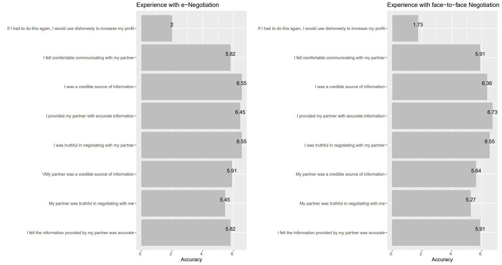
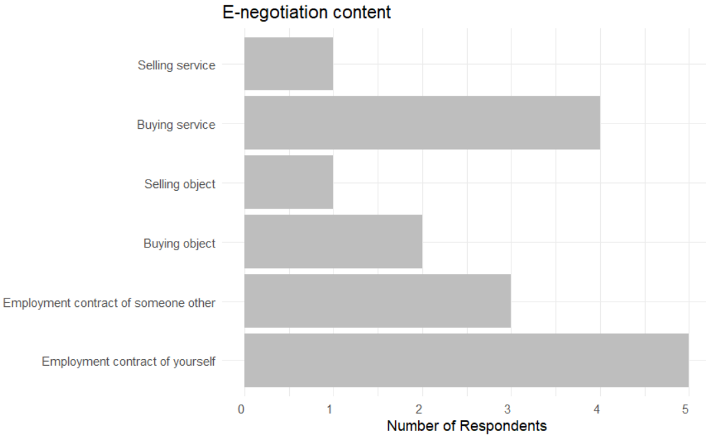
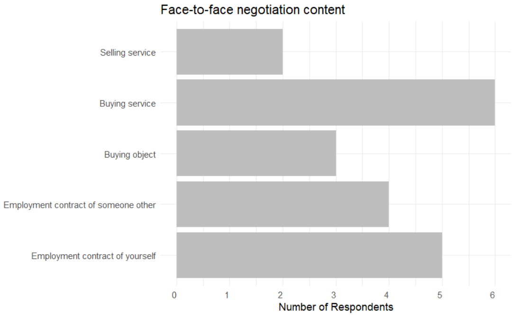
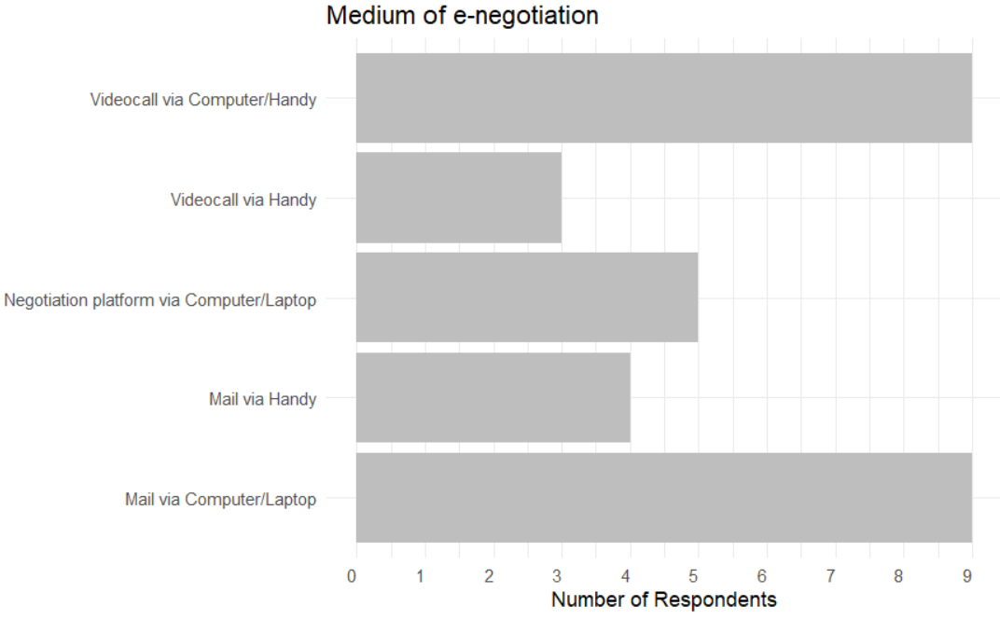
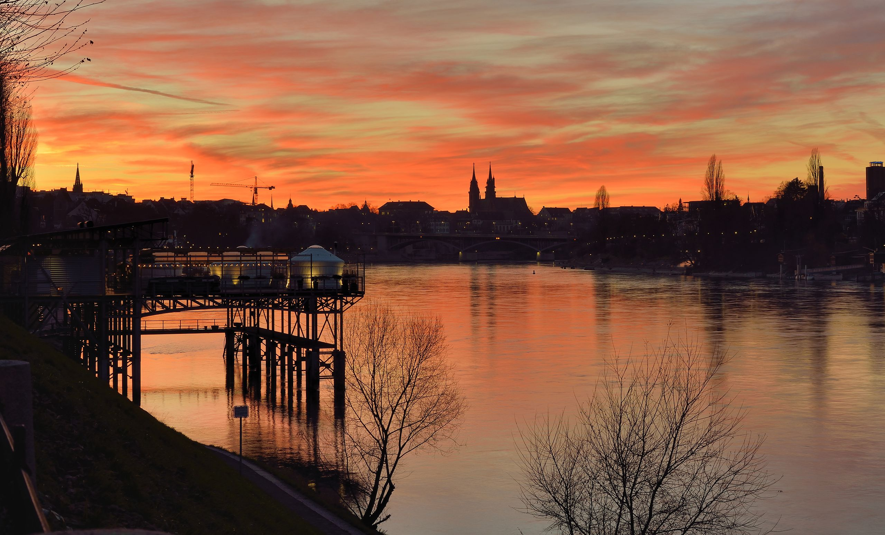

```{r setup, include=FALSE}
knitr::opts_chunk$set(echo = FALSE)

# Learn more about creating websites with Distill at:
# https://rstudio.github.io/distill/website.html

```


Here you can see a profile of face-to-face negotiations and e-negotiations. Participants were asked about their personal experiences with negotiations in the two contexts (ftf vs. e-). The final goal is to create different profiles of negotiations and to discover possible trends in an explorative way.



This graphic shows what the content of the e-negotiation was. Most e-negotiations were about the employment contract of the survey participants themselves.


In contrast to the e-negotiation context, the content that was negotiated most in face to face negotiations was buying a service 



Further you can see which medium is used most by e-negotiators. 


At this point I wanna thank Antony Berbert, who supported me with the creation of this website. 
Here you can visit his website: https://antonyberbert.github.io/RTraining/ 

If you read all this, thanks and enjoy this beautiful sunset picture of Basel :)




